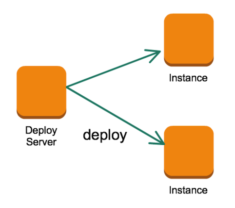
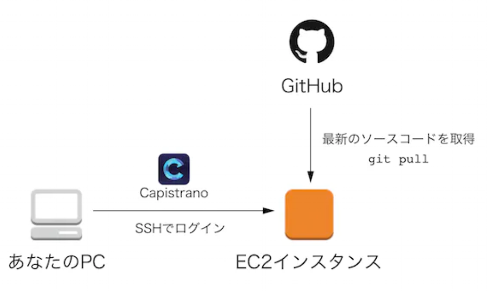

# 目次

<!-- TOC -->

- [01-01. ネットワークの全体像](#01-01-ネットワークの全体像)
    - [:pushpin: インターネット，WAN，LAN](#pushpin-インターネットwanlan)
    - [:pushpin: WAN，LANの具体例](#pushpin-wanlanの具体例)
    - [:pushpin: WANの種類と歴史](#pushpin-wanの種類と歴史)
    - [:pushpin: グローバルネットワークとプライベートネットワーク](#pushpin-グローバルネットワークとプライベートネットワーク)
    - [:pushpin: プライベートネットワークにおけるセグメント](#pushpin-プライベートネットワークにおけるセグメント)
    - [:pushpin: ネットワークにおけるデータ通信方法の種類](#pushpin-ネットワークにおけるデータ通信方法の種類)
- [02-01. OSI参照モデルとTCP階層モデル](#02-01-osi参照モデルとtcp階層モデル)
    - [:pushpin: データの作成，ヘッダ情報追加，カプセル化](#pushpin-データの作成ヘッダ情報追加カプセル化)
    - [:pushpin: OSI参照モデルにおいて各概念層で追加されるヘッダ情報の内容](#pushpin-osi参照モデルにおいて各概念層で追加されるヘッダ情報の内容)
    - [:pushpin: プロトコルの分類と扱われる階層](#pushpin-プロトコルの分類と扱われる階層)
- [02-02. 通信機器におけるヘッダ情報認識](#02-02-通信機器におけるヘッダ情報認識)
    - [:pushpin: 各概念層の実際の通信機器の対応関係](#pushpin-各概念層の実際の通信機器の対応関係)
    - [:pushpin: 通信機器における各層のヘッダ情報の認識](#pushpin-通信機器における各層のヘッダ情報の認識)
- [02-03. アプリケーション層におけるデータ（メッセージ）の作成](#02-03-アプリケーション層におけるデータメッセージの作成)
    - [:pushpin: URLとメールアドレスの構造](#pushpin-urlとメールアドレスの構造)
    - [:pushpin: RESTful APIに対するリクエストメッセージの構造](#pushpin-restful-apiに対するリクエストメッセージの構造)
    - [:pushpin: （補足）SOAP APIに対するリクエストメッセージの構造](#pushpin-補足soap-apiに対するリクエストメッセージの構造)
    - [:pushpin: レスポンスメッセージの構造](#pushpin-レスポンスメッセージの構造)
    - [:pushpin: HTTPステータスの種類](#pushpin-httpステータスの種類)
- [02-04. アプリケーション層におけるメールデータの作成](#02-04-アプリケーション層におけるメールデータの作成)
    - [:pushpin: メール送信用プロトコル](#pushpin-メール送信用プロトコル)
    - [:pushpin: メール受信用プロトコル](#pushpin-メール受信用プロトコル)
- [02-05. トランスポート層におけるヘッダ情報追加](#02-05-トランスポート層におけるヘッダ情報追加)
    - [:pushpin: TCPによるヘッダ情報の追加と識別の仕組み](#pushpin-tcpによるヘッダ情報の追加と識別の仕組み)
    - [:pushpin: ポートスキャナ](#pushpin-ポートスキャナ)
    - [:pushpin: ポート番号の種類](#pushpin-ポート番号の種類)
- [02-06. インターネット層におけるヘッダ情報追加](#02-06-インターネット層におけるヘッダ情報追加)
    - [:pushpin: IPパケットのヘッダ情報を用いた宛先認識](#pushpin-ipパケットのヘッダ情報を用いた宛先認識)
    - [:pushpin: IPv4アドレスの種類](#pushpin-ipv4アドレスの種類)
    - [:pushpin: IPアドレスとbitとの関係](#pushpin-ipアドレスとbitとの関係)
    - [:pushpin: IPアドレスのネットワーク部とホスト部](#pushpin-ipアドレスのネットワーク部とホスト部)
    - [:pushpin: DNSサーバとhostsファイルの役割](#pushpin-dnsサーバとhostsファイルの役割)
- [02-07. ルータの種類](#02-07-ルータの種類)
    - [:pushpin: NAT：Network Address TranslationによるIPアドレスv4の変換](#pushpin-natnetwork-address-translationによるipアドレスv4の変換)
    - [:pushpin: NAPT：Network Address Port Translationによるポート番号の変換](#pushpin-naptnetwork-address-port-translationによるポート番号の変換)
- [03-01. Webシステムを構成する主要な3層構造](#03-01-webシステムを構成する主要な3層構造)
    - [:pushpin: WebサーバソフトウェアをもつWebサーバ](#pushpin-webサーバソフトウェアをもつwebサーバ)
    - [:pushpin: APサーバソフトウェアをもつAPサーバ](#pushpin-apサーバソフトウェアをもつapサーバ)
    - [:pushpin: データベース管理システムをもつDBサーバ](#pushpin-データベース管理システムをもつdbサーバ)
    - [:pushpin: サーバの処理能力向上](#pushpin-サーバの処理能力向上)
- [03-02. Webシステムの構成方法](#03-02-webシステムの構成方法)
    - [:pushpin: Dualシステム](#pushpin-dualシステム)
    - [:pushpin: Duplexシステム](#pushpin-duplexシステム)
    - [:pushpin: システムの稼働率](#pushpin-システムの稼働率)
- [03-03. Web API](#03-03-web-api)
    - [:pushpin: RESTful API](#pushpin-restful-api)
    - [:pushpin: SOAP API](#pushpin-soap-api)
- [03-04. サーバ間のリクエストとレスポンス](#03-04-サーバ間のリクエストとレスポンス)
    - [:pushpin: サーバ間のデータ通信に要する時間](#pushpin-サーバ間のデータ通信に要する時間)
    - [:pushpin: Proxyサーバの役割](#pushpin-proxyサーバの役割)
    - [:pushpin: Proxyサーバ（Fw/Re），DNSサーバ，Webサーバによる名前解決](#pushpin-proxyサーバfwrednsサーバwebサーバによる名前解決)
- [03-05. キャッシュ，Cookie，セッションID](#03-05-キャッシュcookieセッションid)
    - [:pushpin: キャッシュ](#pushpin-キャッシュ)
    - [:pushpin: CookieプロトコルによるCookie情報の送受信](#pushpin-cookieプロトコルによるcookie情報の送受信)
    - [:pushpin: CookieプロトコルによるセッションIDの送受信](#pushpin-cookieプロトコルによるセッションidの送受信)
- [04-01. オンプレミスとクラウドコンピューティング](#04-01-オンプレミスとクラウドコンピューティング)
    - [:pushpin: On premise](#pushpin-on-premise)
    - [:pushpin: IaaS：Infrastructure as a Service](#pushpin-iaasinfrastructure-as-a-service)
    - [:pushpin: PaaS：Platform as a Service](#pushpin-paasplatform-as-a-service)
    - [:pushpin: FaaS：Platform as a Service](#pushpin-faasplatform-as-a-service)
    - [:pushpin: SaaS：Software as a Service](#pushpin-saassoftware-as-a-service)
- [04-02. AWSにおけるクラウドサーバへのデプロイ](#04-02-awsにおけるクラウドサーバへのデプロイ)
    - [:pushpin: クラウドデプロイサーバからクラウドWebサーバへのデプロイの手順](#pushpin-クラウドデプロイサーバからクラウドwebサーバへのデプロイの手順)
    - [:pushpin: デプロイにデプロイツールを用いる場合](#pushpin-デプロイにデプロイツールを用いる場合)
    - [:pushpin: デプロイにAWS CodeDeployを用いる場合](#pushpin-デプロイにaws-codedeployを用いる場合)
- [04-03. AWSにおけるグローバルネットワーク構成](#04-03-awsにおけるグローバルネットワーク構成)
    - [:pushpin: クラウドデザイン例](#pushpin-クラウドデザイン例)
    - [:pushpin: Route 53 ⇒ DNSサーバに相当](#pushpin-route-53-⇒-dnsサーバに相当)
    - [:pushpin: CloudFront ⇒ プロキシサーバに相当](#pushpin-cloudfront-⇒-プロキシサーバに相当)
    - [:pushpin: CloudWatch ⇒ ログ収集サーバに相当](#pushpin-cloudwatch-⇒-ログ収集サーバに相当)
    - [:pushpin: S3：Simple Storage Service ⇒ 外付けストレージに相当](#pushpin-s3simple-storage-service-⇒-外付けストレージに相当)
    - [:pushpin: SQS：Amazon Simple Queue Service](#pushpin-sqsamazon-simple-queue-service)
    - [:pushpin: Lambdaとの連携によるサーバレスアーキテクチャ](#pushpin-lambdaとの連携によるサーバレスアーキテクチャ)
- [04-04. AWSにおけるプライベートネットワーク構成](#04-04-awsにおけるプライベートネットワーク構成)
    - [:pushpin: クラウドデザイン例（再掲）](#pushpin-クラウドデザイン例再掲)
    - [:pushpin: セキュリティグループ ⇒ パケットフィルタリング型ファイアウォールに相当](#pushpin-セキュリティグループ-⇒-パケットフィルタリング型ファイアウォールに相当)
    - [:pushpin: VPC：Virtual Private Cloud ⇒ プライベートネットワークに相当](#pushpin-vpcvirtual-private-cloud-⇒-プライベートネットワークに相当)
    - [:pushpin: VPCエンドポイント](#pushpin-vpcエンドポイント)
    - [:pushpin: ELB：Elastic Load Balancing](#pushpin-elbelastic-load-balancing)
    - [:pushpin: RegionとAvailability Zone](#pushpin-regionとavailability-zone)
    - [:pushpin: VPC subnet](#pushpin-vpc-subnet)
    - [:pushpin: Route Table ⇒ マッピングテーブルに相当](#pushpin-route-table-⇒-マッピングテーブルに相当)
    - [:pushpin: ネットワークACL](#pushpin-ネットワークacl)
    - [:pushpin: Dualシステム（再掲）](#pushpin-dualシステム再掲)
- [04-05. GCPによるWebサービスのリリース](#04-05-gcpによるwebサービスのリリース)
    - [:pushpin: クラウドデザイン例](#pushpin-クラウドデザイン例-1)
    - [:pushpin: GAE：Google App Engine：GAE](#pushpin-gaegoogle-app-enginegae)
    - [:pushpin: GCE：Google Compute Engine](#pushpin-gcegoogle-compute-engine)

<!-- /TOC -->

## 01-01. ネットワークの全体像

### :pushpin: インターネット，WAN，LAN

ネットワークには，『インターネット』『WAN』『LAN』がある．家庭内LAN，学内LAN，企業内LAN，企業WANなど，さまざまなネットワークがあり，インターネットは，それぞれのネットワークを互いに接続しているネットワークである．


### :pushpin: WAN，LANの具体例

例えば，LANとしてEthernet，WANとしてデジタル専用線を用いる．


### :pushpin: WANの種類と歴史


### :pushpin: グローバルネットワークとプライベートネットワーク

ルータを境に，プライベートネットワークとグローバルネットワークに分けられる．ややこしいが，ルータにはグローバルIPアドレスが割り当てられている．


### :pushpin: プライベートネットワークにおけるセグメント

プライベートネットワークは，外部ネットワーク，非武装地帯，内部ネットワークに分類される．

- **非武装地帯に設置するべきサーバの種類**

攻撃の影響が内部ネットワークに広がる可能性を防ぐために，外部から直接リクエストを受ける，『DNSサーバ』『Proxyサーバ』『Webサーバ』『メールサーバ』は，非武装地帯に設置するべき．

- **内部ネットワークに設置するべきサーバの種類**

外部から直接リクエストを受けない．『データベースサーバ』は，内部ネットワークに設置するべき．


### :pushpin: ネットワークにおけるデータ通信方法の種類

- **回線交換方式**

  少数対少数でデータ通信を行うため，送信時に，送信者と受信者の宛先情報は必要ない．

  

- **パケット交換方式**

  通信するデータをパケット化する．多数対多数でデータ通信を行うため，送信時に，送信者と受信者の宛先情報が必要になる．

  


## 02-01. OSI参照モデルとTCP階層モデル

### :pushpin: データの作成，ヘッダ情報追加，カプセル化

パケット交換方式におけるパケットのヘッダ情報は，パソコンの各概念層のプロトコルによって追加されていく．


### :pushpin: OSI参照モデルにおいて各概念層で追加されるヘッダ情報の内容


### :pushpin: プロトコルの分類と扱われる階層

TCP/IPモデルで用いられるプロトコルのうち，最も代表的な「TCP」と「IP」から名前をとって「TCP/IP」と名付けられた．プロトコルとしての暗号化技術である『セキュアプロトコル』は，赤色で示してある．


## 02-02. 通信機器におけるヘッダ情報認識

### :pushpin: 各概念層の実際の通信機器の対応関係


- **ネットワーク層**

- **データリンク層**

- **物理層**

Network Interface Card（（例）LANアダプタ，LANボード，LANカード），リピータ，LANケーブル


### :pushpin: 通信機器における各層のヘッダ情報の認識

送信元で作成されたパケットは，非カプセル化されながら，通信機器に認識される．


## 02-03. アプリケーション層におけるデータ（メッセージ）の作成

### :pushpin: URLとメールアドレスの構造

- **各部品の名称**


- **完全修飾ドメイン名の構造**


- **パスパラメータとクエリパラメータの使い分け**

パスパラメータはデータをリクエストするために用いる．また，クエリパラメータはデータを，検索処理，フィルタ処理，ソート処理をリクエストするために用いる．

```yaml
# 完全修飾ドメイン名 + ルート + パスパラメータ + ? + クエリパラメータ

http://127.0.0.1 + testform.php + 777 + ? + text1=a&text2=b
```


- **各部品の様々な組み合わせ**


### :pushpin: RESTful APIに対するリクエストメッセージの構造

アプリケーション層で生成されるデータを，メッセージという．リクエスト時にクライアント側で生成されるメッセージをリクエストメッセージ，レスポンス時にサーバ側で生成されるメッセージをレスポンスメッセージという．

- **GET送信の場合**

クエリパラメータに送信するデータを記述する方法．リクエストメッセージは，以下の要素に分類できる．以下では，Web APIのうち，特にRESTfulAPIに対して送信するためのリクエストメッセージの構造を説明する．

1. リクエスト行
2. ヘッダー：リクエストの詳細情報（SSLによって暗号化される部分）
3. 送信方法：GET
4. リクエストの対象：ファイルへのパス
5. HTTPプロトコルのバージョン
6. User-Agent：ブラウザのバージョン情報等
7. Accept：ブラウザが想定する(利用可能な)MIMEのタイプ
8. Referer：遷移元のページ
9. Accept-Encoding：ブラウザがデコードできるエンコーディング形式
10. Accept-Language：ブラウザが想定する(利用可能な)言語


- **POST送信の場合**
  

クエリパラメータに送信するデータを記述せず，メッセージボディに記述してリクエストメッセージを送る方法．以下では，Web APIのうち，特にRESTfulAPIに対して送信するためのリクエストメッセージの構造を説明する．メッセージボディに情報が記述されるため，履歴では確認できない．リクエストメッセージは，以下の要素に分類できる．

1. リクエスト行
2. ヘッダー：リクエストの詳細情報（SSLによって暗号化される部分）
3. 空白行：ヘッダーとボディを分ける
4. ボディ：画面での入力内容が入っている（SSLによって暗号化される部分）
5. 送信方法：POST
6. リクエストの対象：ファイルへのパス
7. HTTPプロトコルのバージョン


### :pushpin: （補足）SOAP APIに対するリクエストメッセージの構造

- **POST送信の場合**


### :pushpin: レスポンスメッセージの構造

1. HTTPステータス
2. ヘッダー：レスポンスの詳細情報がある（SSLによって暗号化される部分）
3. 空白行：ヘッダーとボディを分ける
4. ボディ：HTMLや画像等が入る（SSLによって暗号化される部分）
5. HTTPプロトコルのバージョン
6. ステータスコード：200はサーバーのWebシステム処理が成功したことを表す
7. Server：サーバーの名前とバージョン等です．
8. Content-Type：出力するMIMEタイプ


### :pushpin: HTTPステータスの種類

- **100番台：継続**
- **200番台：リクエスト成功**
- **300番台：リダイレクトに関するステータス**
- **400番台：リクエスト失敗**
- **500番台：サーバーエラー**


## 02-04. アプリケーション層におけるメールデータの作成

### :pushpin: メール送信用プロトコル

- **SMTP AUTH：Simple Mail Transfer Protocol AUTHentication**

  メール送信にあたってユーザ認証の仕組みがないSMTPを拡張し，ユーザ認証機能を追加した仕様．


### :pushpin: メール受信用プロトコル

- **POP3：Post Official Protocol version 3**

  メールサーバに届いたメールを，受信機器にダウンロードし，受信機器で閲覧するプロトコル．メールの既読未読状況は，他の受信機器と共有される．
  
- **IMAP4：Internet Message Access Protocol version 3**

  メールサーバに届いたメールを，受信機器にダウンロードせず，メールサーバに置いたまま閲覧するプロトコル．メールの既読未読状況は，他の受信機器と共有されない．

  **【具体例】**
  
  GmailでPOPかIMAPを設定可能


- **APOP：Authenticated POP**

  メール受信の際に，チャレンジレスポンス方式の認証を行うことで平文の認証情報がネットワークに流れるのを防止するプロトコル

  

## 02-05. トランスポート層におけるヘッダ情報追加

### :pushpin: TCPによるヘッダ情報の追加と識別の仕組み


リクエストでは，パケットが通過してきたポート番号をヘッダ情報として追加する．レスポンスでは，プライベートIPアドレスを用いて，レスポンス先のパソコンを識別する．その後，リクエスト時のポート番号を元にして，特定のアプリにレスポンスする．


### :pushpin: ポートスキャナ

ポートスキャナを用いることによって，各ポートにアクセスし，応答があるかどうかや，どのようなソフトウェアが応答するかを調べ，一覧表示することができる．


### :pushpin: ポート番号の種類

アプリには，種類ごとにポート番号が割り当てられている．

- **Well known ポート番号（0 ～ 1023）**

  IANA：Internet Assigned Numbers Authority（インターネット割当番号公社）によって管理されているポート番号．Webサーバがリクエストを受信する時，またレスポンスを送信する時に使用される．ホストPCとゲストPC（仮想サーバ）との通信では，80番（HTTP）の受信に関する様々な設定が必要になる．

  

- **登録済みポート番号（1024 ～ 49151）**

  IANAが登録申請を受けて公開しているポート番号．企業が作成した独自のアプリなどに対して割り当てられる．クライアントがリクエストを送信する時，またレスポンスを受信する時に使用される．

- **動的／非公式ポート番号（49152 ～ 65535）**

  自由に使用できるポート番号．クライアントがリクエストを送信する時，またレスポンスを受信する時に使用される．


## 02-06. インターネット層におけるヘッダ情報追加

### :pushpin: IPパケットのヘッダ情報を用いた宛先認識

1. PC-Aは，構成したIPパケットをEthernetに乗せて，ルータAに送信．
2. ルータAは，IPパケットをデジタル専用線に乗せて，ルータBに送信．
3. ルータBは，構成したIPパケットをEthernetに乗せて，Webサーバに送信．


### :pushpin: IPv4アドレスの種類


- **プライベートIPアドレス**

  LAN内で使用される．異なるプライベートネットワーク間では，同じIPv4アドレスが存在する．プライベートIPアドレスは，『```10.0.0.0``` ～ ```10.255.255.255```』，『```172.16.0.0``` ～ ```172.31.255.255```』，『```192.168.0.0``` ～ ```192.168.255.255```』で表される．

- **グローバルIPアドレス**

  プロバイダが提供するIPv4アドレス．パブリックネットワーク内に同じIPv4アドレスは存在せず，Network Information Centerへの使用申請が必要．プライベートIPアドレスの番号でなければ，グローバルIPアドレスである．NATはグローバルIPアドレスを持っており，プライベートIPアドレスうと相互変換する．
  
  

### :pushpin: IPアドレスとbitとの関係

例えば，プライベートIPアドレスの４つのオクテットが１Byteの容量をもち，IPアドレス全体で４Byteの容量をもつ．ちなみに，172から始まるIPアドレスは，クラスBである．


### :pushpin: IPアドレスのネットワーク部とホスト部


- **クラスフルアドレッシング**

IPアドレスの特徴からクラスとして分類し，各クラスでIPアドレスのネットワーク部とホスト部を定義する方法．

|         IPアドレスの範囲         |          IPアドレスの特徴           | 対応するクラス | ネットワーク部（固定） | 割り当て可能なホスト数 |
| :------------------------------: | :---------------------------------: | :------------: | :--------------------: | :--------------------: |
| ```0.0.0.0``` 〜 ```127.255.255.255``` | ```0xxxxxxx.xxxxxxxx.xxxxxxxx.xxxxxxxx``` |       A        |         8 bit          |       16777214個       |
|   ```128.0.0.0``` 〜 ```191.255.255.255```   | ```10xxxxxx.xxxxxxxx.xxxxxxxx.xxxxxxxx``` |       B        |         16 bit         |        65534個         |
|   ```192.0.0.0``` 〜 ```223.255.255.255```   | ```110xxxxx.xxxxxxxx.xxxxxxxx.xxxxxxxx``` |       C        |         24 bit         |         254個          |
|   ```224.0.0.0``` 〜 ```239.255.255.255```   | ```1110xxxx.xxxxxxxx.xxxxxxxx.xxxxxxxx``` |       D        |           -            |           -            |
|   ```240.0.0.0``` 〜 ```255.255.255.255```   | ```1111xxxx.xxxxxxxx.xxxxxxxx.xxxxxxxx``` |       E        |           -            |           -            |

- **サブネットマスクの記述**

『1』あるいは『0』でIPアドレスのネットワーク部とホスト部を定義し，IPアドレスの後ろに記述する方法（**【具体例】**```192.168.42.23/24```）．ネットワーク部を何bitとするかを『1』，ホスト部を『0』で表現する．二進数形式，IPアドレス形式，1の数で表すCIDR形式による表現方法がある．

|                二進数形式                 |    IPアドレス形式     |    CIDR形式    | 割り当て可能なホスト数 |
| :---------------------------------------: | :-------------------: | :------------: | :--------------------: |
| ```10000000.00000000.00000000.00000000``` |    ```128.0.0.0```    |       /1       |                        |
| ```11000000.00000000.00000000.00000000``` |    ```192.0.0.0```    |       /2       |                        |
|                    ...                    |          ...          |      ...       |                        |
| ```11111111.00000000.00000000.00000000``` |    ```255.0.0.0```    |       /8       |                        |
|                    ...                    |          ...          |      ...       |                        |
| ```11111111.11111110.00000000.00000000``` |   ```255.254.0.0```   |      /15       |                        |
| ```11111111.11111111.00000000.00000000``` |   ```255.255.0.0```   | /16 → オススメ |                        |
|                                           |          ...          |      ...       |                        |
| ```11111111.11111111.11111110.00000000``` |  ```255.255.254.0```  |      /23       |                        |
| ```11111111.11111111.11111111.00000000``` |  ```255.255.255.0```  |      /24       |         251個          |
|                    ...                    |          ...          |      ...       |                        |
| ```11111111.11111111.11111111.11111110``` | ```255.255.255.254``` |      /31       |                        |
| ```11111111.11111111.11111111.11111111``` | ```255.255.255.255``` |      /32       |                        |


CIDR形式では，IPアドレスの範囲を簡潔に表現することができる．例えばIPアドレスが```216.98.224.0``` 〜 ```216.98.239.255```までの範囲では， ```216.98.224.0/20```と書くことができる。範囲の計算方法は，別途調べること．


### :pushpin: DNSサーバとhostsファイルの役割

- **完全修飾ドメイン名とグローバルIPアドレスのマッピング**


例えば，外部WebサーバのグローバルIPアドレスが『203.142.205.139』であると知っている場合，URLのプロトコル部分以下を『```203.142.205.139```』としてリクエストすれば，外部Webサーバが提供するウェブサイトにアクセスできる．しかし，グローバルIPアドレスは数字の羅列であるため，人間には覚えにくい．そこで，グローバルIPアドレスの代わりに，完全修飾ドメイン名をURLの一部として用いる．

- **hostsファイル**

DNSサーバよりも先に参照されるマッピングファイル．WebサーバのIPアドレスがDNSサーバに登録されていない時，またDNSサーバが不具合の時に，DNSサーバの代わりとして用いる．


## 02-07. ルータの種類

### :pushpin: NAT：Network Address TranslationによるIPアドレスv4の変換

一つのグローバルIPアドレスに，一つのプライベートIPアドレスが紐づいている時に用いられるルータ．

- **リクエスト時のルータにおける変換**

  NATはグローバルIPアドレスを持っており，パケットのヘッダ情報におけるプライベートIPアドレスとグローバルIPアドレスを相互変換する．
  
  例えば，GoogleでWebページを見ながら，Gmailアプリを起動している場合，リクエストにおけるパケット情報として…
  
  **【変換例】**
  
  | 送信元プライベートIPアドレス |  ⇄   | 送信元グローバルIPアドレス |
  | :--------------------------: | :--: | :------------------------: |
  |      ```192.168.1.1```       |      |      ```200.1.1.1```       |

1. 『送信元プライベートIPアドレス』『送信先グローバルIPアドレス』『メールサーバの待ち受けポート番号110（POP3）』を指定して，メールサーバにリクエスト

2. 『送信元プライベートIPアドレス』『送信先グローバルIPアドレス』『Webサーバの待ち受けポート番号80（HTTP）』を指定して，Webサーバにリクエスト

3. 『送信元プライベートIPアドレス』『送信先グローバルIPアドレス』『DNSサーバの待ち受けポート番号53（DNS）』を指定して，DNSサーバにリクエスト
4. これらの『送信元プライベートIPアドレス』が，NATルータで，グローバルIPアドレスに変換される．


- **レスポンス時の変換**


### :pushpin: NAPT：Network Address Port Translationによるポート番号の変換

一つのグローバルIPアドレスに，複数のプライベートIPアドレスが紐づいている時に用いられるルータ．

- **リクエスト時の変換**

  NATはグローバルIPアドレスを持っており，NATと同様にプライベートIPアドレスとグローバルIPアドレスの間を相互変換する．また，一つのポート番号を複数の異なるポート番号に変換する．

  **【変換例】**

  | 送信元プライベートIPアドレス | 変換前ポート番号 |  ⇄   | 送信元グローバルIPアドレス | 変換後ポート番号 |
  | :--------------------------: | :--------------: | :--: | :------------------------: | :--------------: |
  |      ```192.168.2.1```       |      50011       |      |   ```130.X.X.X:50011```    |      50011       |
  |      ```192.168.3.1```       |      50011       |      |   ```130.X.X.X:50012```    |      50012       |


- **レスポンス時の変換**


## 03-01. Webシステムを構成する主要な3層構造

Webサーバ，APサーバ，DBサーバによるネットワークの仕組みをWebシステムという．ソフトウェアとハードウェアのノートも参照せよ．


### :pushpin: WebサーバソフトウェアをもつWebサーバ

Webサーバソフトウェア（Apache，Nginxなど）がインストールされている．また，Web兼APサーバソフトウェア（NGINX Unit）がインストールされていることもある．役割として，Webブラウザから静的コンテンツのリクエストがあった場合に，アプリケーションサーバにリクエストを行う．アプリケーションサーバからレスポンスを受け取り，Webブラウザにレスポンスを行う．

- **サーバ変数（```$_SERVER```）**

```PHP
$_SERVER['SERVER_ADDR']           サーバのIPアドレス(例:192.168.0.1)
$_SERVER['SERVER_NAME']           サーバの名前(例:www.example.com)
$_SERVER['SERVER_PORT']           サーバのポート番号(例:80)
$_SERVER['SERVER_PROTOCOL']       サーバプロトコル(例:HTTP/1.1)
$_SERVER['SERVER_ADMIN']          サーバの管理者(例:root@localhost)
$_SERVER['SERVER_SIGNATURE']      サーバのシグニチャ(例:Apache/2.2.15...)
$_SERVER['SERVER_SOFTWARE']       サーバソフトウェア(例:Apache/2.2.15...)
$_SERVER['GATEWAY_INTERFACE']     CGIバージョン(例:CGI/1.1)
$_SERVER['DOCUMENT_ROOT']         ドキュメントルート(例:/var/www/html)
$_SERVER['PATH']                  環境変数PATHの値(例:/sbin:/usr/sbin:/bin:/usr/bin)
$_SERVER['PATH_TRANSLATED']       スクリプトファイル名(例:/var/www/html/test.php)
$_SERVER['SCRIPT_FILENAME']       スクリプトファイル名(例:/var/www/html/test.php)
$_SERVER['REQUEST_URI']           リクエストのURI(例:/test.php)
$_SERVER['PHP_SELF']              PHPスクリプト名(例:/test.php)
$_SERVER['SCRIPT_NAME']           スクリプト名(例:/test.php)
$_SERVER['PATH_INFO']             URLの引数に指定されたパス名(例:/test.php/aaa)
$_SERVER['ORIG_PATH_INFO']        PHPで処理される前のPATH_INFO情報
$_SERVER['QUERY_STRING']          URLの?以降に記述された引数(例:q=123)
$_SERVER['REMOTE_ADDR']           クライアントのIPアドレス(例:192.168.0.123)
$_SERVER['REMOTE_HOST']           クライアント名(例:client32.example.com)
$_SERVER['REMOTE_PORT']           クライアントのポート番号(例:64799)
$_SERVER['REMOTE_USER']           クライアントのユーザ名(例:tanaka)
$_SERVER['REQUEST_METHOD']        リクエストメソッド(例:GET)
$_SERVER['REQUEST_TIME']          リクエストのタイムスタンプ(例:1351987425)
$_SERVER['REQUEST_TIME_FLOAT']    リクエストのタイムスタンプ(マイクロ秒)(PHP 5.1.0以降)
$_SERVER['REDIRECT_REMOTE_USER']  リダイレクトされた場合の認証ユーザ(例:tanaka)
$_SERVER['HTTP_ACCEPT']           リクエストのAccept:ヘッダの値(例:text/html)
$_SERVER['HTTP_ACCEPT_CHARSET']   リクエストのAccept-Charset:ヘッダの値(例:utf-8)
$_SERVER['HTTP_ACCEPT_ENCODING']  リクエストのAccept-Encoding:ヘッダの値(例:gzip)
$_SERVER['HTTP_ACCEPT_LANGUAGE']  リクエストのAccept-Language:ヘッダの値(ja,en-US)
$_SERVER['HTTP_CACHE_CONTROL']    リクエストのCache-Control:ヘッダの値(例:max-age=0)
$_SERVER['HTTP_CONNECTION']       リクエストのConnection:ヘッダの値(例:keep-alive)
$_SERVER['HTTP_HOST']             リクエストのHost:ヘッダの値(例:www.example.com)
$_SERVER['HTTP_REFERER']          リンクの参照元URL(例:http://www.example.com/)
$_SERVER['HTTP_USER_AGENT']       リクエストのUser-Agent:ヘッダの値(例:Mozilla/5.0...)
$_SERVER['HTTPS']                 HTTPSを利用しているか否か(例:on)
$_SERVER['PHP_AUTH_DIGEST']       ダイジェスト認証時のAuthorization:ヘッダの値
$_SERVER['PHP_AUTH_USER']         HTTP認証時のユーザ名
$_SERVER['PHP_AUTH_PW']           HTTP認証時のパスワード
$_SERVER['AUTH_TYPE']             HTTP認証時の認証形式
```

- **リクエスト変数（```$_REQUEST```）**

GET変数（```$_GET```），POST変数（```$_POST```），COOKIE（```$_COOKIE```）をまとめた連想配列．

- **セッション変数（```$_SESSION```）**


- **Symfonyフレームワークによる各変数の取得**

```PHP
// $_GET['hoge']
$request->query->get('hoge');
 
// $_POST['hoge']
$request->request->get('hoge');
 
// ルーティングパラメータ / ex) @Route('/{hoge}')
$request->attributes->get('hoge');
 
// $_COOKIE['hoge']
$request->cookies->get('hoge');
 
// $_FILES['hoge']
$request->files->get('hoge');
 
// $_SERVER['SCRIPT_FILENAME']
$request->server->get('SCRIPT_FILENAME');
 
// $_SERVER['HTTP_USER_AGENT']
$request->headers->get('User-Agent');
 
// query > attribute  > request の順で検索
$request->get('hoge');
```


### :pushpin: APサーバソフトウェアをもつAPサーバ

PHPにおいては，APサーバソフトウェア（PHPならPHP-FPM，JavaならTomcat）がインストールされている．役割として，Webサーバから動的コンテンツのリクエストがあった場合に，プログラミング言語を言語プロセッサで翻訳し，DBサーバにリクエストを行う．DBサーバからのレスポンスを受け取り，Webサーバに動的なコンテンツのレスポンスを行う．


### :pushpin: データベース管理システムをもつDBサーバ

データベース管理システムがインストールされている．データベースの情報が保存されている．


### :pushpin: サーバの処理能力向上

- **スケールアップ ⇔ スケールダウン**

  サーバ自体のスペックをより高くすることで，サーバ当たりの処理能力を向上させる．その逆は，スケールダウン．設定で，仮想サーバのスペックを上げることも，これに該当する．

  

- **スケールアウト ⇔ スケールイン**

  サーバの台数を増やすことで，サーバ全体の処理能力を向上させる．その逆は，スケールイン．

  


## 03-02. Webシステムの構成方法

### :pushpin: Dualシステム

同じ処理を行う2つのシステムからなるシステム構成のこと．随時，処理結果を照合する．いずれかが故障した場合，異常が発生したシステムを切り離し，残る片方で処理を続けることによって，故障を乗り切る．


### :pushpin: Duplexシステム

オンライン処理を行う主系システムと，バッチ処理を行う従系システムからなるシステム構成のこと．主系システムが故障した場合，主系システムのオンライン処理を従系システムに引き継ぎ，処理を続けることによって，故障を乗り切る．


従系システムの待機方法には２つの種類がある．

- **ホットスタンバイ**

  

- **コールドスタンバイ**

  


### :pushpin: システムの稼働率

並列システムの場合，両方の非稼働率をかけて，全体から引く．

**【具体例】**

１－(1－0.81) × (1－0.64) = 0.9316


## 03-03. Web API

### :pushpin: RESTful API

分散型システムにおける複数のソフトウェアを連携させるのに適したアーキテクチャスタイルをRESTという．また，これに基づいた設計をRESTfulという．RESTful APIについては，RESTfulAPIの概念と実装（PHP）のノートを参照せよ．また，アーキテクチャスタイルについては，オブジェクト指向分析・設計のノートを参照せよ．


### :pushpin: SOAP API

1999年にMicrosoft社などによって発表された．2000年前半には企業システムのWebサービス化とともに普及するかに思われたが，複雑な構造であったため次第に敬遠されるようになった．その後，簡単な構造のRESTが好まれるようになった．


## 03-04. サーバ間のリクエストとレスポンス

### :pushpin: サーバ間のデータ通信に要する時間

ネットワークのデータグローバル光回線が用いられている．光は，30万km／秒であり，円周4万kmの地球を7.5周／秒できることからもわかるように，遠く離れた国にあるWebサーバであっても，データ通信に要する時間は，１秒にも満たない．


### :pushpin: Proxyサーバの役割

- **代理リクエスト機能（セキュリティのノートも参照）**

代理でリクエストを送るフォワードProxyサーバと，レスポンスを送るリバースProxyサーバに分類できる．


- **キャッシュ機能**

リバースProxyサーバに，Webページのコンテンツをキャッシュとして保存することによって，Webサーバのアクセス負荷を抑える．ちなみに，ブラウザもキャッシュ機能を持っている．


- **フォワードProxyサーバとリバースProxyサーバの設置場所**

フォワードProxyサーバはプロバイダの会社に，リバースProxyサーバはリクエスト先の社内ネットワークに設置されている．


### :pushpin: Proxyサーバ（Fw/Re），DNSサーバ，Webサーバによる名前解決


- **（1）完全修飾ドメイン名に対応するIPアドレスのレスポンス**

1. クライアントPCは，完全修飾ドメイン名を，フォワードProxyサーバにリクエスト．
2. フォワードProxyサーバは，完全修飾ドメイン名を，リバースProxyサーバに代理リクエスト．
3. リバースProxyサーバは，完全修飾ドメイン名を，DNSサーバに代理リクエスト．
4. DNSサーバは，完全修飾ドメインにマッピングされるIPv4アドレスを取得し，リバースProxyサーバにレスポンス．
5. リバースProxyサーバは，IPv4アドレスを，フォワードProxyサーバに代理レスポンス．（※NATによるIPv4アドレスのネットワーク間変換が起こる）
6. フォワードProxyサーバは，IPv4アドレスを，クライアントPCに代理レスポンス．

- **（2）IPアドレスに対応するWebページのレスポンス**

1. クライアントPCは，レスポンスされたIPv4アドレスを基に，Webページを，リバースProxyサーバにリクエスト．
2. リバースProxyサーバは，Webページを，Webサーバに代理リクエスト．
3. Webサーバは，Webページを，リバースProxyサーバにレスポンス．
4. リバースProxyサーバは，Webページを，クライアントPCに代理レスポンス．

※上記の様に，リクエストとレスポンスが繰り返されるが，データ通信は光速なので，１秒もかからない．


## 03-05. キャッシュ，Cookie，セッションID

### :pushpin: キャッシュ

Webページのコンテンツ（HTML，CSS，画像など）は，以下の場所にキャッシュとして保存される．

- **リバースProxyサーバによるキャッシュ機能**

リバースProxyサーバに，キャッシュとして保存される．リバースProxyサーバの説明を参照せよ．

- **ブラウザによるキャッシュ機能**

クライアントのブラウザに，キャッシュとして保存される．


### :pushpin: CookieプロトコルによるCookie情報の送受信

- **Cookie情報の送受信の仕組み**

1. 最初，ブラウザはリクエストでデータを送信する．サーバはセッション変数（あるいはDB）にデータを格納する．
2. サーバは，レスポンスヘッダ情報のCookieプロトコルにCookie情報を埋め込んで送信する．
3. ブラウザは，そのCookie情報を保存する．
4. 2回目以降のリクエストでは，ブラウザは，リクエストヘッダ情報のCookieプロトコルにCookie情報を埋め込んでサーバに送信する．サーバは，Cookie情報に紐づくクライアントのデータをReadする．


### :pushpin: CookieプロトコルによるセッションIDの送受信

- **セッションIDの送受信の仕組み**

1. 最初，ブラウザはリクエストでデータを送信する．サーバはセッション変数（あるいはDB）にデータを格納する．
2. サーバは，レスポンスヘッダ情報のCookieプロトコルにセッションIDを埋め込んで送信する．
3. ブラウザは，そのセッションIDを保存する．
4. 2回目以降のリクエストでは，ブラウザは，リクエストヘッダ情報のCookieプロトコルにセッションIDを埋め込んでサーバに送信する．サーバは，セッションIDに紐づくクライアントのデータをReadする．


- **セッションID送受信とページ遷移**


## 04-01. オンプレミスとクラウドコンピューティング

ベンダーが，システムを稼働させるために必要なソフトウェアとハードウェアをどこまで提供するかによって，サービスの名称が異なる．


### :pushpin: On premise

ベンダーは関わらず，ユーザの設備によって，システムを運用すること．


### :pushpin: IaaS：Infrastructure as a Service

**【Iaasアプリ例】**

Amazon Web Service，Google Cloud Platform，Microsoft Azure，IBM Cloud


### :pushpin: PaaS：Platform as a Service

**【Paasアプリ例】**

Google App Engine，Windows Azure


### :pushpin: FaaS：Platform as a Service

ユーザは関数の実装のみを行い，それ以外はベンダーにやってもらうサービスのこと．

**【サービス例】**

Lambda


### :pushpin: SaaS：Software as a Service

従来はパッケージとして提供していたアプリケーションを，Webアプリケーションとして提供するサービスのこと．

**【サービス例】**

Google Apps（Google Map，Google Cloud，Google Calender など）


## 04-02. AWSにおけるクラウドサーバへのデプロイ

### :pushpin: クラウドデプロイサーバからクラウドWebサーバへのデプロイの手順

1. クラウドデプロイサーバからクラウドWebサーバにリモート接続する．



2. 本番環境（ここではクラウドWebサーバ）にインストールしておいたGitで，```pull```あるいは```clone```を実行し，GitHubからクラウドデプロイサーバにmasterブランチの状態を取り込む．


### :pushpin: デプロイにデプロイツールを用いる場合

クラウドデプロイサーバに自動デプロイツール（例：Capistrano）を配置する．自動デプロイツールがクラウドWebサーバやDBサーバにリモート接続し，```pull```や```clone```を実行する．




### :pushpin: デプロイにAWS CodeDeployを用いる場合


## 04-03. AWSにおけるグローバルネットワーク構成

AWSから，グローバルIPアドレスと完全修飾ドメイン名が提供され，Webサービスがリリースされる．

### :pushpin: クラウドデザイン例

以下のデザイン例では，Dualシステムが採用されている．


### :pushpin: Route 53 ⇒ DNSサーバに相当

クラウドDNSサーバーとして働く．リクエストされた完全修飾ドメイン名とインスタンスのグローバルIPアドレスをマッピングしている．


### :pushpin: CloudFront ⇒ プロキシサーバに相当　

クラウドプロキシサーバとして働く．Amazon S3へのアクセスをキャッシングする．


### :pushpin: CloudWatch ⇒ ログ収集サーバに相当

AWSの各種サービスで生成されたログファイルを収集し，外部サービスへ通知できるサービス．


### :pushpin: S3：Simple Storage Service ⇒ 外付けストレージに相当

クラウド外付けストレージとして働く．Amazon S3に保存するCSSファイルや画像ファイルを管理できる．


### :pushpin: SQS：Amazon Simple Queue Service

クラウドメッセージキューとして働く．異なるVPC間でも，メッセージキューを同期できる．クラウドサーバで生成されたメッセージは，一旦SQSに追加される．コマンドによってバッチが実行され，メッセージが取り出される．その後，例えば，バッチ処理によってメッセージからデータが取り出されてファイルが生成され，S3に保存されるような処理が続く．スタンダード方式キューとFIFO方式：First In First Outキューがある．


### :pushpin: Lambdaとの連携によるサーバレスアーキテクチャ

Lambdaを軸に他のFaaSと連携させることによって，ユーザ側は関数プログラムを作成しさえすれば，これを実行することができる．この方法を，『サーバレスアーキテクチャ』という．


## 04-04. AWSにおけるプライベートネットワーク構成

### :pushpin: クラウドデザイン例（再掲）


### :pushpin: セキュリティグループ ⇒ パケットフィルタリング型ファイアウォールに相当

クラウドパケットフィルタリング型ファイアウォールとして働く．インバウンド（受信ルール）では，プロトコルや受信元IPアドレスを設定でき，アウトバウンド（送信ルール）では，プロトコルや送信先プロトコルを設定できる．

- **パケットフィルタリング型ファイアウォールとは（セキュリティのノートを参照せよ）**

パケットのヘッダ情報に記載された送信元IPアドレスやポート番号などによって，パケットを許可するべきかどうかを決定する．速度を重視する場合はこちら．ファイアウォールとWebサーバの間には，NATルータやNAPTルータが設置されている．これらによる送信元プライベートIPアドレスから送信元グローバルIPアドレスへの変換についても参照せよ．


### :pushpin: VPC：Virtual Private Cloud ⇒ プライベートネットワークに相当

クラウドプライベートネットワークとして働く．プライベートIPアドレスが割り当てられた，VPCと呼ばれるプライベートネットワークを仮想的に構築することができる．異なるAvailability Zoneに渡ってkクラウドWebサーバを立ち上げることによって，クラウドサーバをデュアル化することできる．


### :pushpin: VPCエンドポイント

NATとインターネットゲートウェイを経由せずにVPCの外側と通信できるため，NATの負荷を抑え，またより安全に通信できる．


### :pushpin: ELB：Elastic Load Balancing

デュアル化させたインスタンスへのアクセスを自動的に分配し，サーバへの負荷を緩和するサービス．機能別に，NLB：Network Load Balancer，ALB：Application Load Balancer，CLB：Classic Load Balancer，の3種類に分類できる．


### :pushpin: RegionとAvailability Zone

2016年1月6日時点では，以下のRegionに物理サーバのデータセンターがある．さらに，各データセンターは物理的に独立したAvailability Zoneというロケーションから構成されている．東京Regionには，3つのAvailability Zoneがある．AZの中に，VPC subnetを作ることができ，そこにクラウドWebサーバを構築できる．


### :pushpin: VPC subnet

クラウドプライベートネットワークにおけるセグメントとして働く．

- **パブリックサブネット**

非武装地帯に相当し，クラウドWebサーバが構築される．攻撃の影響が内部ネットワークに広がる可能性を防ぐために，外部から直接リクエストを受ける，

- **プライベートサブネット**

内部ネットワークに相当し，Amazon Aurora（クラウドデータベース）などが構築される．外部から直接リクエストを受けずにレスポンスを返せるように，プライベートサブネット内のNATを経由させる必要がある．


### :pushpin: Route Table ⇒ マッピングテーブルに相当

クラウドルータのマッピングテーブルとして働く．ルータについては，NATとNAPTを参照せよ．

| Destination（サブネット内からの送信先IPアドレス） | Target |
| :-----------------------------------------------: | :----: |
|                 ```xx.x.x.x/xx```                 | 送信先 |

図中で，サブネット2にはルートテーブル1が関連づけられており，サブネット2内のインスタンスの送信先が```10.0.0.0/16```の範囲であれば，local（VPC内の他サブネット）を送信先に選び，範囲外であれば通信を破棄する．サブネット3にはルートテーブル2が関連づけられており，サブネット3内のインスタンスの送信先が```10.0.0.0/16```の範囲であれば，local（VPC内の他サブネット）を送信先に選び，```0.0.0.0/0```（全てのIPアドレス）の範囲内であれば，インターネットゲートウェイを送信先に選ぶ．


### :pushpin: ネットワークACL


### :pushpin: Dualシステム（再掲）

同じ処理を行う2つのシステムからなるシステム構成のこと．随時，処理結果を照合する．いずれかが故障した場合，異常が発生したシステムを切り離し，残る片方で処理を続けることによって，故障を乗り切る．


## 04-05. GCPによるWebサービスのリリース

GCPから，グローバルIPアドレスと完全修飾ドメイン名が提供され，Webサービスがリリースされる．

### :pushpin: クラウドデザイン例

以下のデザイン例では，Dualシステムが採用されている．


### :pushpin: GAE：Google App Engine：GAE

クラウドデプロイサーバとして働く．AWSにおけるElastic Beanstalkに相当する．


### :pushpin: GCE：Google Compute Engine

クラウドWebサーバとして働く．AWSにおけるEC2に相当する．